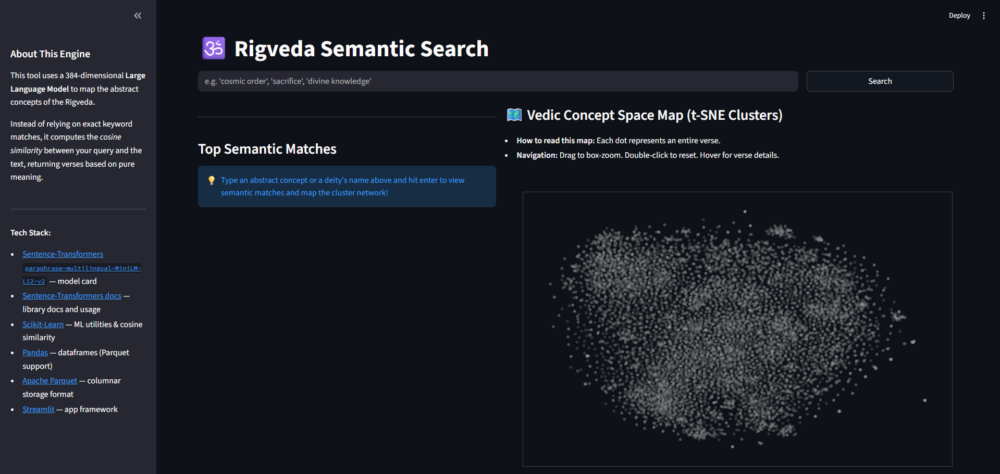
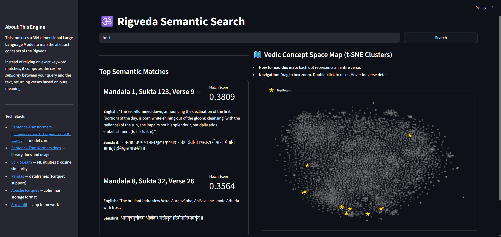

# Rigveda Semantic Search Engine

## Overview

This project is an end-to-end Machine Learning pipeline and interactive web application designed to explore the **Rigveda**, the oldest of the sacred Vedic Sanskrit texts.



By transforming complex, deeply nested hierarchical data into a flat Parallel Corpus and passing it through a multilingual Large Language Model (LLM), this tool allows users to search ancient scriptures using modern **Semantic Vector Search**. Instead of relying on exact keyword matches, the engine understands the abstract meaning of a user's query (e.g., "the creation of the universe" or "chariots of war") and returns the most conceptually relevant Sanskrit verses alongside their English translations. Furthermore, the connected graph takes the embeddings and sorts them via similarity, highlighting the top 10 verses on the map on top of the query results.



To solve the issue with how conceptual and poetic the Rigveda are, this project uses **NLP Embeddings** to map the abstract concepts of the text into a 384-dimensional vector space, allowing for similarity matching based on *meaning* rather than exact phrasing.

## Tech Stack & Architecture

- **Frontend:** Streamlit (Cached data and model loading for instant UI response)
- **Machine Learning:** Hugging Face `SentenceTransformers` (`paraphrase-multilingual-MiniLM-L12-v2`)
- **Vector Math:** Scikit-Learn (`cosine_similarity`)
- **Data Engineering:** Pandas, NumPy
- **Storage:** Parquet (Compressed columnar storage bypassing standard CSV limits)

## Features

- **Semantic Retrieval Engine:** Computes cosine similarity between user queries and 10,000+ Vedic verses in real-time.
- **Robust Data Pipeline:** Parses irregular, nested dictionary structures (Mandala → Sukta → Verse) into a clean, machine-readable format.
- **Lightning-Fast UI:** Utilizes Streamlit's `@st.cache_resource` and `@st.cache_data` decorators to hold the 384-dimension LLM and the vector matrix in memory.
- **Parallel Text Alignment:** Aligns the raw Devanagari text, accented Vedic text (Svaras), and English translations for side-by-side analysis.

## Data Dictionary

The underlying dataset (`rigveda_clean.parquet`) contains the following structure:

| Column Name | Type | Description |
|-------------|------|-------------|
| `mandala` | String | The book number (1-10) of the Rigveda. |
| `sukta` | String | The hymn number within the Mandala. |
| `verse_num` | Int | The specific verse (Rik) number. |
| `sanskrit_verse` | String | Samhita text. Continuous recitation format. |
| `display_sanskrit` | String | Accented text containing Vedic Svaras. |
| `english_translation` | String | English translation of the verse. |
| `embedding` | Array[Float] | The 384-dimensional vector representation of the translation. |

## Setup & Installation

1. Clone the repository and navigate to the directory:

```bash
git clone https://github.com/RamLanka05/Sanskrit-Analysis.git
cd Sanskrit-Analysis
```

2. Create and activate a virtual environment.

For Windows:

```bash
python -m venv .venv
.\.venv\Scripts\activate
```

For macOS / Linux:

```bash
python3 -m venv .venv
source .venv/bin/activate
```

3. Install the required dependencies:

```bash
pip install streamlit pandas numpy scikit-learn sentence-transformers pyarrow
```

4. Run the application:

```bash
streamlit run app.py
```

## Current Status & Future Roadmap

This application currently has the following functionalities:

* **Deterministic Text Normalization:** Cleans and sanitizes highly irregular, hallucination-riddled 19th-century OCR data through an engineered regex pipeline that preserves unique Sanskrit diacritics and enforces proper noun boundaries.
* **Dense Vector Semantic Search:** Computes real-time cosine similarity between arbitrary natural language user queries and 10,000+ Vedic verses using an in-memory 384-dimensional vector matrix.
* **Interactive t-SNE Dimensionality Reduction:** Visualizes the entire Rigveda text corpus on a 2D coordinate space, dynamically isolating and highlighting the top 10 most relevant search results directly on the map.
* **High-Performance Caching & Parallel Alignment:** Utilizes Streamlit's resource memory caching to hold the underlying multilingual embedding model and Parquet storage in memory, ensuring sub-second UI responses while displaying side-by-side comparative text (Devanagari, accented Svaras, and English).

This is what the next development phases would focus on:

* **Vector Database Integration:** Transition the local in-memory NumPy vector search matrix into a production-grade vector database (such as **ChromaDB** or **FAISS**). This will enable faster hybrid indexing and support scaling the system to handle larger commentarial text collections.
* **Faceted Metadata Filtering:** Build a hybrid retrieval pipeline that allows users to constrain vector searches using structural boundaries—such as limiting an abstract query exclusively to the older "Family Books" (Mandalas 2-7) or targeting specific Vedic deity classifications.
* **Cross-Lingual Embedding Alignment:** Upgrade the embedding backend to a specialized Indic-language model (like `LaBSE` or `IndicBERT`) to establish a direct mathematical mapping between native Devanagari queries, IAST transliterations, and historical English translations.
* **Diachronic Semantic Analysis:** Implement analytical dashboards that calculate and graph the density of semantic concepts across the textual timeline of the 10 Mandalas, allowing for mathematical tracing of how specific philosophical concepts evolved or shifted frequency.

## Author

### Sathvik Ram Lanka

- **GitHub:** [@RamLanka05](https://github.com/RamLanka05)
- **LinkedIn:** [Sathvik Ram Lanka](https://www.linkedin.com/in/sathvik-r-lanka/)
- **Affiliation:** Statistics & Computer Science, University of Illinois Urbana-Champaign

## Acknowledgments

Original raw data structure based on WisdomLib/Vedic textual archives.

English translations and structural alignments are based on the historical scholarly translations of the Rigveda.
